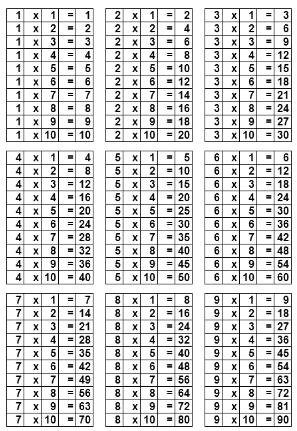
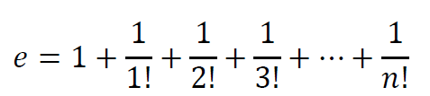

# Lista 2 de Exercícios - LP2
Este projeto contém soluções para os exercícios da Lista 2 da disciplina de Linguagem de Programação 2 (LP2). Cada exercício é implementado em uma classe separada, e o usuário pode escolher qual algoritmo executar a partir do menu principal.

## Exemplo de Execução

Após rodar o Main (após compilar os arquivos de classe), o programa exibirá um menu onde você poderá escolher qual exercício deseja executar.

```bash 
Selecione o número do exercício que deseja executar:
1 - Aprovado, Reprovado ou Prova de Reposição
2 - Verificação de Caracteres
3 - Verificação de Ano Bissexto
4 - Validação de Senha
5 - Impressão da Tabuada
6 - Cálculo do Número de Euler
7 - Cálculo do Fatorial
8 - Divisores de um Número Par
0 - Sair

Digite sua escolha: 1

Informe a primeira nota: 7.5
Informe a segunda nota: 8.0
Informe a terceira nota: 6.0

Resultado: Aprovado
```


# LISTA 2


1. Desenvolva um algoritmo que, baseado no regulamento dos cursos de graduação da

UFRN (título VI / Cap 01 Art 114 e seguintes), receba três notas de alunos de graduação e possa

definir se ele foi aprovado, reprovado ou se ele poderá fazer a prova de reposição.

2. Escreva um programa que leia um caractere e diga se ele é uma vogal, consoante ou

um número (qualquer outra opção deve ser caracterizada como um símbolo).

3. Chama-se ano bissexto o ano ao qual é acrescentado um dia extra, ficando ele com 366

dias, um dia a mais do que os anos normais de 365 dias, ocorrendo a cada quatro anos. Escreva

um programa que verifique se um ano é bissexto. Um ano é bissexto se ele é divisível por 4.

Entretanto, se o ano é divisível por 100, ele não é bissexto. Mas, se ele for divisível por 400, ele

volta a ser bissexto.

a. São bissextos os anos: 1600, 1996, 2000, 2004, 2008, 2012, 2016, 2400.

b. Não são bissextos: 1500, 1974, 1982, 1983, 1990, 2018, 2022, 2030, 2038.

4. Escreva um programa que verifique a validade de uma senha fornecida pelo usuário. A

senha válida é o número 1234. Devem ser impressas as seguintes mensagens:

ACESSO PERMITIDO caso a senha seja válida.

ACESSO NEGADO caso a senha seja inválida.

OBS.: Utilize a estrutura Do While{ }.

5. Desenvolva um algoritmo que imprima a tabuada do número 1 até o número 9.

  



  

6. O número de Euler pode ser representado e calculado por meio da utilização da série de

Taylor e quando X=1, como a soma da seguinte série infinita:

  
  



  

7. O fatorial é uma operação muito importante para o estudo e desenvolvimento da análise

combinatória. Na matemática o número seguido do símbolo de exclamação (!) é

conhecido como fatorial. Desenvolva um algoritmo que imprima o fatorial de um número

N, digitado pelo usuário.

8. Desenvolva um algoritmo que receba um número natural inteiro par e retorne todos os

seus divisores. (utilize WHILE)
